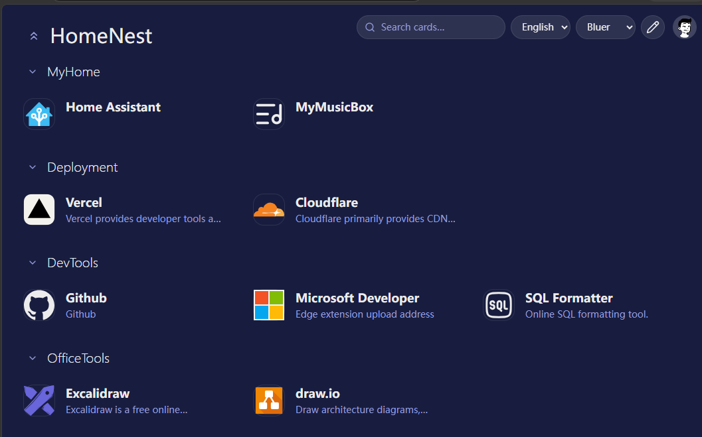

<h1 align="center">HomeNest</h1>
<p align="center">
  <i>A minimal, self-hosted homepage for your services. Organize everything in one place and keep an eye on their status.</i>
  <br/><br/>
  <b><a href="#getting-started">Getting Started</a></b> | <b><a href="#deployment">Deployment</a></b> | <b><a href="#usage">Usage</a></b> | <b><a href="README.zh-CN.md">中文文档</a></b>
  <br/><br/>
  <a href="LICENSE"></a>
  <a href="NOTICE"></a>
  
  
</p>

---

## About

**HomeNest** is a fork of [Mafl](https://github.com/hywax/mafl) by Hywax, modernized and extended for multi-platform serverless deployment. It preserves the original's minimalistic design and YAML-based configuration while adding a storage abstraction layer, Nuxt 4 migration, and Cloudflare/Vercel free-tier optimizations.

<p align="center">
  
</p>

> **Attribution**: This project is derived from [Mafl](https://github.com/hywax/mafl) (MIT License, Copyright (c) 2023-PRESENT Hywax). The original copyright notice and license are preserved in [LICENSE](LICENSE) and [NOTICE](NOTICE).

## Tech Stack

| Layer | Technology |
|---|---|
| Framework | [Nuxt 4](https://nuxt.com) (Vue 3 + Nitro server engine) |
| Language | TypeScript 5 |
| Styling | [Tailwind CSS](https://tailwindcss.com) via `@nuxtjs/tailwindcss` |
| Validation | [Zod](https://zod.dev) schemas (`h3-zod`) |
| i18n | `@nuxtjs/i18n` — 2 languages (en, zh), no-prefix strategy |
| Themes | `@nuxtjs/color-mode` —system/light/dark/deep/sepia/bluer |
| PWA | `@vite-pwa/nuxt` —installable web app |
| Icons | `@nuxt/icon` (Iconify) + custom URL/local icons |
| Avatars | [DiceBear](https://dicebear.com) —25+ styles |
| Storage | `FilesystemDriver` (self-hosted) / `VercelKVDriver` (serverless) |
| Config | YAML parsing via `yaml` package |
| Editor | Drag-and-drop via `vue-draggable-plus` |
| Build | Vite 8, ESLint (@antfu/eslint-config), Husky + lint-staged |

## Project Structure

```
src/
├── components/          # Vue components
│   ├── editor/          # Editor UI (PropertyPanel, StyleFields, IconPicker…)
│   └── service/         # Service card components (Base, IpApi, OpenWeatherMap)
├── composables/         # Vue composables (useEditor, useServiceData, useContentI18n…)
├── locales/             # i18n translation files (en-US.js, zh-CN.js, …)
├── plugins/             # Nuxt plugins (settings, auth)
├── server/
│   ├── api/             # API routes (config, auth, services, geo, update)
│   ├── storage/         # Storage drivers & stores (Config, User, Preferences)
│   ├── utils/           # Server utilities (auth, config, services, favicon)
│   └── validations/     # Zod schemas (config, service)
├── types/               # TypeScript type definitions
└── utils/               # Shared utilities (registry, style)
data/                    # Runtime data (config.yml, users.json, icons/)
```

## Getting Started

### Development

```shell
git clone https://github.com/ThunderLotus/homenest.git
cd homenest
npm install --legacy-peer-deps
npm run dev          # →http://localhost:13008
```

Default login: **Admin / Admin**

### Production (Node)

```shell
npm run build
node .output/server/index.mjs    # →http://localhost:3000
```

### Production (Docker)

```yaml
# docker-compose.yml
services:
  homenest:
    image: thunderlotus/homenest:latest
    restart: unless-stopped
    ports:
      - '13008:3000'
    volumes:
      - ./data:/app/data
```

```shell
docker compose up -d
```

## Deployment

### Self-hosted (Docker / VPS)

Default mode —uses `FilesystemDriver` with the `data/` directory. No extra configuration needed.

### Vercel

**Prerequisites**: A [Vercel](https://vercel.com) account and a [GitHub](https://github.com) account.

#### Step 1 —Fork the repository

1. Go to `https://github.com/ThunderLotus/homenest` (your fork)
2. Click **Fork** to create your own copy

#### Step 2 —Create an Upstash Redis database

1. Go to [Upstash Console](https://console.upstash.com) → **Redis** —**Create Database**
2. Name it `homenest-kv`, choose a region close to your Vercel deployment region
3. Click **Create**
4. Copy the **REST URL** (`https://....upstash.io`) and **REST Token** —you'll need these in Step 4

#### Step 3 —Import to Vercel

1. Go to [Vercel Dashboard](https://vercel.com/dashboard) → **Add New** —**Project**
2. Import your forked `homenest` repository
3. Vercel auto-detects Nuxt → keep the default build settings
4. **Don't deploy yet** —click **Environment Variables** first

#### Step 4 —Configure environment variables

In the Vercel project settings → **Environment Variables**, add:

| Name | Value | Environments |
|---|---|---|
| `KV_REST_API_URL` | Your Upstash REST URL from Step 2 | Production, Preview, Development |
| `KV_REST_API_TOKEN` | Your Upstash REST Token from Step 2 | Production, Preview, Development |

> **Alternative**: Instead of manual env vars, you can link a Vercel KV store (Storage → KV —Create —Connect to Project). Vercel auto-injects the same variables. Either approach works.

#### Step 5 —Deploy

1. Click **Deploy**
2. Wait for the build to complete (~2-3 min)
3. Visit your deployment URL (e.g. `https://homenest-xxx.vercel.app`)
4. Log in with **Admin / Admin** —change the password immediately

#### Step 6 —Verify persistence

1. Add a few services in the editor and click **Save**
2. Redeploy the project (or push a new commit) —your config should persist
3. Check Upstash console —**Data** tab to see stored keys (`config.yml`, `users.json`, etc.)

> **Note**: WebSocket is auto-disabled on Vercel (serverless doesn't support long connections). Config sync uses 10-second version polling instead.

---

### Cloudflare Pages

**Prerequisites**: A [Cloudflare](https://cloudflare.com) account and a [GitHub](https://github.com) account.

#### Step 1 —Fork the repository

Same as Vercel Step 1 —fork `ThunderLotus/homenest` to your GitHub account.

#### Step 2 —Create an Upstash Redis database

Same as Vercel Step 2 —create an Upstash Redis instance and copy the REST URL and Token.

> **Why Upstash instead of Cloudflare KV?** HomeNest uses `@vercel/kv` SDK which talks to Upstash Redis REST API. Cloudflare KV has a different API and is not currently supported. Upstash free tier (10K commands/day) is sufficient for personal use.

#### Step 3 —Create a Cloudflare Pages project

1. Go to [Cloudflare Dashboard](https://dash.cloudflare.com) → **Workers & Pages** —**Create** —**Pages** —**Connect to Git**
2. Select your forked `homenest` repository
3. Set the **Framework preset** to `None` (we'll configure manually)
4. Set **Build command** to `NITRO_PRESET=cloudflare-pages npx nuxi build`
5. Set **Build output directory** to `.output/public`
6. Click **Save and Deploy** —but **don't worry if the first build fails**, you still need to add environment variables

#### Step 4 —Configure environment variables

Go to **Settings** —**Environment variables** —add the following for **Production** (and **Preview** if needed):

| Variable name | Value |
|---|---|
| `KV_REST_API_URL` | Your Upstash REST URL from Step 2 |
| `KV_REST_API_TOKEN` | Your Upstash REST Token from Step 2 |
| `NITRO_PRESET` | `cloudflare-pages` |

#### Step 5 —Enable `nodejs_compat` flag

1. Go to **Settings** —**Functions** —**Compatibility flags**
2. Add `nodejs_compat` to both **Production** and **Preview** compatibility flags
3. This enables Node.js APIs (needed for `crypto.scryptSync` used in legacy password verification)

#### Step 6 —Deploy

1. Go to **Deployments** —click **Retry deployment** (or push a new commit to trigger a rebuild)
2. Wait for the build to complete (~3-5 min)
3. Visit your Pages URL (e.g. `https://homenest.pages.dev`)
4. Log in with **Admin / Admin** —change the password immediately

#### Step 7 —Verify persistence

1. Add a few services in the editor and click **Save**
2. Trigger a redeploy —your config should persist
3. Check Upstash console —**Data** tab to verify stored keys

> **Notes**:
> - WebSocket is auto-disabled on Cloudflare Pages. Config sync uses 10-second version polling.
> - Password hashing uses PBKDF2 via Web Crypto API (<1ms CPU, well within Workers' 10ms limit).
> - `@network-utils/tcp-ping` is removed —service health checks use HTTP fetch only.

### Releasing a New Version

Docker images are published automatically via GitHub Actions (`.github/workflows/release.yml`). Pushing a `v*.*.*` git tag triggers a multi-arch build (linux/amd64 + linux/arm64) pushed to Docker Hub and GitHub Container Registry.

#### One-time setup — GitHub Secrets

1. Create a Docker Hub access token: [hub.docker.com](https://hub.docker.com) → Account Settings → Security → New Access Token
2. Add repository secrets in your fork → Settings → Secrets and variables → Actions:

| Secret | Value |
|---|---|
| `DOCKERHUB_USERNAME` | Your Docker Hub username |
| `DOCKERHUB_TOKEN` | The access token from step 1 |

#### Release flow

1. Bump `version` in `package.json` (e.g. `1.0.2`), or run `npm run release` which uses `changelogen` to bump + generate CHANGELOG + tag automatically
2. Push the tag:

```shell
git tag v1.0.2
git push origin v1.0.2
```

3. Watch the build: GitHub → Actions → "Release Docker Image" (~5-10 min for multi-arch)

#### Resulting images

For tag `v1.0.2`, the workflow pushes:

| Registry | Tags |
|---|---|
| Docker Hub | `<DOCKERHUB_USERNAME>/homenest:v1.0.2`, `:latest`, `:v1` |
| GHCR | `ghcr.io/<DOCKERHUB_USERNAME>/homenest:v1.0.2`, `:latest`, `:v1` |

> **Note**: The tag must match `v*.*.*` (three-segment semver) to trigger the workflow and produce the `latest` + `v<major>` tags. Prerelease tags like `v2.0.0-alpha.1` only produce the exact tag. The version shown in the UI comes from `package.json`'s `version` field, injected at build time — no need to touch `config.sample.yml`.

### Environment Variables

| Variable | Purpose | Default |
|---|---|---|
| `HOMENEST_GITHUB_REPO` | GitHub repo for update notifications | `ThunderLotus/homenest` (disabled) |
| `KV_REST_API_URL` | Vercel KV / Upstash Redis URL | —|
| `KV_REST_API_TOKEN` | Vercel KV / Upstash Redis token | —|
| `MAFL_STORAGE_DRIVER` | Force storage driver (`vercel-kv`) | auto-detect |

### Storage Driver Selection

| Environment | Detection | Driver |
|---|---|---|
| Self-hosted | Default | `FilesystemDriver` —`data/` |
| Vercel | `KV_REST_API_URL` present | `VercelKVDriver` —Upstash Redis |
| Manual | `MAFL_STORAGE_DRIVER=vercel-kv` | `VercelKVDriver` |

## Storage Architecture

```
┌────────────── API Routes (src/server/api/) ─────────────────────────┐
├────────────── Dedicated Stores (src/server/storage/) ────────────────────────┐
│  ConfigStore  UserStore  PreferencesStore  IconStore │
├────────────── StorageDriver Abstraction ─────────────────────────┐
│  FilesystemDriver          VercelKVDriver           │
├────────────── Backing Storage ─────────────────────────────────┐
│  useStorage('data')       @vercel/kv (Upstash Redis) │
│  + global TTL cache (5s)  + session secret cache     │
└──────────────────────────────────────────────────┘
```

### Data Layout

**Self-hosted** (`data/`):
```
data/
├── config.yml              # Site config (YAML)
├── users.json              # User accounts (JSON)
├── .session-secret         # Session signing secret
├── preferences_*.json      # User preferences
└── icons/                  # Cached icons
```

**Vercel / Cloudflare** (Upstash Redis KV):
```
"config.yml"             —YAML string
"users.json"             —JSON object
".session-secret"        —hex string
"__raw:icons/<hash>.png" —base64-encoded bytes
"__ver:config.yml"       —timestamp (version detection)
```

## Usage

### Login

- Default credentials: **Admin / Admin** (change immediately after first login)
- Admin uses `config.yml` (default config)
- Regular users get `config_<username>.yml` (per-user config)

### Editor

Click the **Edit** button (top-left pencil icon) to enter edit mode:

1. **Add group** —Click "Add group" to create a new service group
2. **Add service** —Click "Add service" within a group, choose service type
3. **Drag & drop** —Reorder groups and services by dragging
4. **Property panel** —Click any service to open the side panel:
   - Set title, description, link, icon, tags
   - Configure service-specific options (e.g. coordinates for Weather)
   - Set status monitoring (enable + interval)
   - Customize card style (border radius, padding, colors—
5. **Global settings** —Click the gear icon to edit page title, theme, language, grid layout
6. **Save** —Click "Save" to persist changes to `config.yml`

### Service Types

#### Base
Service card with optional health monitoring (HTTP HEAD probe, 5s timeout).

```yaml
- title: GitHub
  link: https://github.com
  icon:
    name: simple-icons:github
    wrap: true
  status:
    enabled: true
    interval: 30
```

#### IP API
Displays visitor's IP address and geographic location (24min server cache).

```yaml
- title: IP Info
  type: ip-api
  options:
    flagIcon: true
```

#### OpenWeatherMap
Displays current weather for a location (24min server cache). This is a **data service** —no `link` field needed.

```yaml
- title: Weather
  type: openweathermap
  options:
    city: Beijing          # Optional: enter city name, then click "Search city"
    lat: 39.9042            # Latitude (required)
    lon: 116.4074           # Longitude (required)
    units: metric           # metric=°C, imperial=°F, standard=K
  secrets:
    apiKey: your-key        # Free key from home.openweathermap.org/api_keys
```

**Getting coordinates** (in editor property panel):
- **City search** —Enter a city name in the "City" field, click "Search city" to auto-fill lat/lon via OpenWeatherMap Geocoding API
- **IP detection** —Click "Detect coordinates" to auto-fill lat/lon from your current IP
- **Manual** —Look up coordinates at [LatLong.net](https://www.latlong.net/)

**Free API key**: Register at [openweathermap.org](https://home.openweathermap.org/api_keys) —1,000 calls/day for free. The `apiKey` is stored server-side only and never sent to the frontend.

### Icons

- **[Iconify](https://icon-sets.iconify.design/)** —200,000+ vector icons (e.g. `simple-icons:github`, `lucide:home`)
- **Emoji** —Any valid emoji (e.g. `🏠`)
- **URL** —Direct image URL (downloaded & cached locally)
- **Local** —Custom images in `data/icons/`

### User Management (Admin)

Navigate to **Admin —Users** (`/admin/users`):
- Add/remove users
- Reset passwords
- Export user configs
- Roles: Admin (access all configs) / User (access own config only)

### Language & Theme

- **Language** — Switch from the toolbar dropdown (en, zh)
- **Theme** —Switch from the toolbar (system/light/dark/deep/sepia/bluer)
- Settings persist per-user in `preferences_*.json`

### Multi-language Content

Config supports i18n for page title, group titles, and service titles/descriptions:

```yaml
baseLang: en        # Default language of field values
i18n:
  title:
    zh: 我的首页
  groups:
    Home:
      zh: 主页
  services:
    my-service-id:
      zh:
        title: 服务标题
        description: 服务描述
```

## Multi-language UI

| Language | Code |
|---|---|
| English | `en` |
| Chinese | `zh` |

## Free-tier Resource Usage

Optimized for Vercel Hobby and Cloudflare Workers free plans:

| Resource | Vercel Hobby | Cloudflare Workers |
|---|---|---|
| Function calls | ~1,700/day | ~1,700/day |
| Upstash KV commands | ~1,600/day (16% of 10K) | ~1,600/day (16% of 10K) |
| CPU per request | <100ms | <1ms (PBKDF2) |
| Bandwidth | <1GB/month | unlimited |

*Estimates: 1 user, 5 service cards, 4h/day active. See [NOTICE](NOTICE) for full optimization list.*

## Credits

This project is a fork of [Mafl](https://github.com/hywax/mafl) by [Hywax](https://github.com/hywax). All original design, configuration schema, and service implementations originate from the Mafl project.

Original Mafl contributors:


## License & Attribution

- **License**: [MIT](LICENSE) —Copyright (c) 2023-PRESENT Hywax (original Mafl), Copyright (c) 2026-PRESENT HomeNest contributors
- **Fork notice**: See [NOTICE](NOTICE) for the full list of modifications from the original Mafl
- **Third-party**: See [THIRD_PARTY_NOTICES](THIRD_PARTY_NOTICES) for all third-party software, icons, avatars, and their licenses
